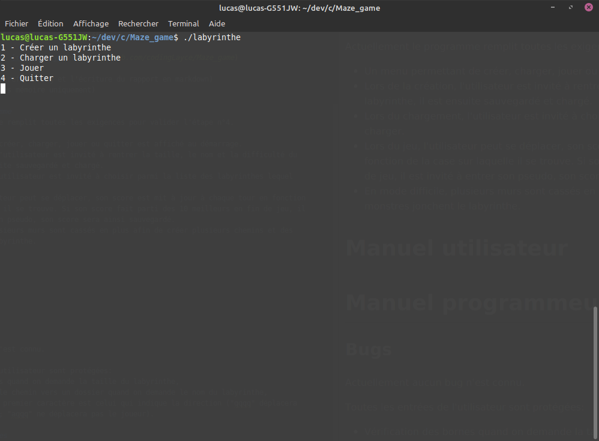

# Rapport projet labyrinthe en C

Le projet consiste à réaliser un programme permettant de créer des labyrinthes parfaits, les
 sauvegarder, les charger et jouer dessus.
 
Plusieurs grandes étapes étaient obligatoires durant la réalisation:

1) Création d'un labyrinthe parfait de taille fixe;
2) Ajout d'un menu permettant de créer, charger, jouer sur un labyrinthe et de quitter; 
3) Ajout de bonus et malus sur les labyrinthes avec un système de scoring et de meilleurs scores;
4) Ajout d'un mode "difficile" ajoutant plus de chemins dans un labyrinthe et des monstres
 rendant la progression plus difficile.

Le projet présenté à été réalisé en monome en C.

Les outils utilisés pour le développement ont été:
- make
- git (un peu tardivement) [repository](https://github.com/codingLayce/Maze_game)
- vim
- intellij (pour quelques refactoring et l'écriture du rapport en markdown)
- valgrind (pour les fuites mémoire uniquement)

## Ce que fait le programme
Actuellement le programme remplit toutes les exigences pour valider l'étape n°4.

- Un menu permettant de créer, charger, jouer ou quitter est affiché au démarrage.
- Lors de la création, l'utilisateur est invité à rentrer la taille, le nom et la difficulté du
 labyrinthe, il est ensuite sauvegardé et chargé.
- Lors du chargement, l'utilisateur est invité à choisir parmi la liste des labyrinthes lequel
 charger.
- Lors du jeu, l'utilisateur peut se déplacer, son score est mit à jour à chaque tour en fonction
 de la case sur laquelle il se trouve. Si son score fait parti des 10 meilleurs en fin de jeu, il
  est invité à entrer son pseudo, son score sera ainsi sauvegardé.
- En mode difficile, plusieurs murs sont cassés en plus afin de créer plusieurs chemins et des
 monstres jonchent le labyrinthe.

# Manuel utilisateur

## Lancement
Afin de lancer le programme, l'utilisateur doit se placer dans le répertoire "bin" et exécuter le
 binaire "labyrinthe".

Le programme possède une configuration permettant de le lancer en français ou en anglais (par
 défaut il se lance en français). Il suffit de rajouter en option de lancement "-lang en" ou
  "-lang fr" afin de modifier la langue du programme.

## Menu
Une fois le programme lancé, l'utilisateur arrive sur le menu du jeu:

Il peut donc choisir parmi les différentes options en renseignant le numéro indiqué.

## Créer un labyrinthe
Lors de la création d'un labyrinthe, l'utilisateur est invité à renseigner la taille du
 labyrinthe, la difficulté ainsi que le nom de celui-ci.
 

## Charger un labyrinthe
Lors du chargement d'un labyrinthe, l'utilisateur est amené à renseigner le numéro correspondant
 au labyrinthe sur lequel il souhaite jouer parmi la liste de ceux sauvegardés.
 

## Jouer
Afin de pouvoir jouer, l'utilisateur doit avoir chargé un labyrinthe (ou créé un) auparavant.

Les 10 meilleurs highscore sont affichés au dessus du labyrinthe. Le score est affiché en
 permanence.
 
Le joueur doit se déplacer via les commandes Z Q S D (Z: Monter Q: Gauche S: Descendre D: Droite).
 
- Les blocs violets représentent les murs,
- Le 'o' bleu représente le joueur,
- Les '$' verts représentent les trésors,
- Les '^' rouges représentent les pièges.

En mode difficile:

- Le 'S' bleu représente une araignée, elle se déplace de façon aléatoire sur le labyrinthe en
 fonction d'un paramètre de mobilité, c'est-à-dire qu'elle ne peut aller plus loin que 5 cases
  autour de la case où elle commence.
- Le 'G' bleu représente un fantôme, il se déplace de façon aléatoire sur tout le labyrinthe, il
 peut traverser les murs.

Quand le joueur rencontre un monstre, 1000 points sont ajoutés au score (il faut en avoir le
 moins possible).

# Manuel programmeur
Le programme est séparé en 3 grandes parties:

- Maze: modèle,
- Movements: logique de movements des différentes entités,
- States: vue assemblant le modèle et les mouvements.
- (Utils: quelques fonctions utilitaires).

## Modèle
J'ai décidé de représenter mon labyrinthe par une matrice de Cell car cela me permet de définir
 le type de chaque cellule ainsi que la valeur de la cellule pour l'algorithme de génération.

Dans le modèle se trouve aussi les fonctions de création du labyrinthe, le système de highscore
 (par des listes chaînées) ainsi que le joueur.
 
Pour le joueur, j'ai décidé de ne faire qu'une structure représentant un joueur humain mais aussi
 un joueur monstre. Cela me permet de faire des fonctions plus génériques mais rend certaines tâches
 plus compliquées (voir améliorations possibles).

Pour la création de mon labyrinthe en mode difficile, il faut casser des murs en plus une fois le
 labyrinthe parfait trouvé. Pour choisir le nombre de murs à casser, j'utilise une formule:
- **10% de la largeur + la hauteur du labyrinthe**

Ex: 10+5 = 15 * 0.1 = 1.5 -> 1 mur.
Ex: 33+13 = 46 * 0.1 = 4.6 -> 4 murs.

De même que pour les murs en mode difficile, il faut choisir un nombre de piège et de trésors à générer 
sur le labyrinthe :
- **Le nombre de cellules vides x un ratio (0.05 par défaut) arrondi à l'entier inférieur**

Ex: 25 x 0.05 = 1.25 -> 1 piège et 1 trésor.
Ex: 150 x 0.05 = 7.5 -> 7 pièges et 7 trésors.

Le système est le même pour les monstres mais avec un ratio différent (0.001 par défaut).

## Mouvements

## Etats

## Tests

## Bugs
Actuellement un bug est connu:

Si le programme n'est pas lancé depuis le dossier bin, il sera impossible de récupérer les
 sauvegardes n'y même d'en créer.

Toutes les entrées de l'utilisateur sont protégées:
- Vérification des bornes quand on demande la taille du labyrinthe,
- Impossible de rentrer le chemin vers un dossier quand on demande le nom du labyrinthe,
- Pour le déplacement le premier caractère est celui qui indique la direction ("qqqq" déplacera
 une fois vers la gauche; "aqqq" ne déplacera pas le joueur).

## Améliorations possibles
De mon point de vue, la partie à revoir dans mon code est la partie "Player" et la logique dans
 mon état "game".
 
En 